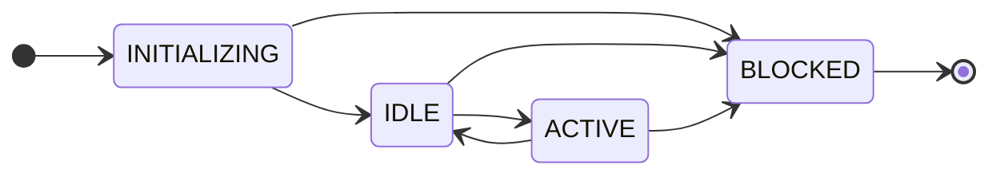

# State diagram for the state machine

```mermaid
stateDiagram
direction LR

    init: INITIALIZING
    idle: IDLE
    active: ACTIVE
    blocked: BLOCKED

    [*] --> init
    init --> idle
    init --> blocked

    idle --> active
    active --> idle
    idle --> blocked
    active --> blocked

    blocked --> [*]
```